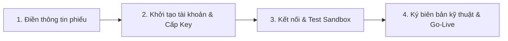

# PHIẾU ĐĂNG KÝ VÀ KHẢO SÁT KẾT NỐI ĐẠI LÝ B2B (API PARTNER)
**HỆ THỐNG DỊCH VỤ VIỄN THÔNG & GIẢI PHÁP SỐ TV9TECH**

---

> **Kính gửi Quý Đối tác,**  
> Để phục vụ việc khởi tạo tài khoản Đại lý API, cấp phát thông tin bảo mật (`Client ID`, `Secret Key`), mở dải IP kết nối và cấu hình luồng định tuyến dịch vụ, Quý Đối tác vui lòng điền đầy đủ các thông tin theo mẫu bên dưới và gửi lại cho Bộ phận Kỹ thuật & Kinh doanh của TV9TECH.

---

## PHẦN 1: THÔNG TIN DOANH NGHIỆP / ĐẠI LÝ

| STT | Trường thông tin | Thông tin Quý Đối tác cung cấp | Ghi chú |
| :---: | :--- | :--- | :--- |
| **1** | **Tên Công ty / Đại lý** (*) | `[Điền tên đầy đủ của đơn vị]` | Theo GPKD hoặc tên đại lý |
| **2** | **Mã viết tắt / Mã đề xuất** (*) | `[Ví dụ: TOPUP_ABC, PARTNER_XYZ]` | Viết hoa, không dấu, liền nhau |
| **3** | **Mã số thuế / Số ĐKKD** | `[Điền mã số thuế]` | Nếu là Doanh nghiệp |
| **4** | **Người đại diện / Người liên hệ** (*) | `[Họ và tên]` | Đầu mối liên hệ chính |
| **5** | **Số điện thoại liên hệ** (*) | `[Số điện thoại/Zalo]` | Nhận thông báo kích hoạt |
| **6** | **Địa chỉ trụ sở / Kinh doanh** | `[Số nhà, đường, phường/xã, quận/huyện, tỉnh/thành]` | |
| **7** | **Số hợp đồng & Ngày ký** | `Số HĐ: ................ Ngày: .../.../202...` | Nếu đã ký kết hợp đồng |

---

## PHẦN 2: THÔNG TIN KỸ THUẬT & KẾT NỐI API

> [!IMPORTANT]
> Nhằm đảm bảo an toàn tuyệt đối cho các giao dịch nạp tiền và mua thẻ, TV9TECH áp dụng cơ chế xác thực kép: **IP Whitelist** và **Chữ ký điện tử HMAC-SHA256**.

| STT | Hạng mục kỹ thuật | Thông tin Quý Đối tác cung cấp | Yêu cầu / Mô tả |
| :---: | :--- | :--- | :--- |
| **1** | **Danh sách IP Server gọi API** (*) | `[Ví dụ: 103.x.x.x, 118.x.x.x]` | **Bắt buộc:** IP tĩnh của server đối tác gọi sang TV9TECH |
| **2** | **URL nhận Webhook (Callback)** (*) | `https://api.doitac.vn/webhook/tv9-callback` | Endpoint nhận kết quả xử lý đơn hàng tự động (Khuyến nghị HTTPS) |
| **3** | **Email kỹ thuật phụ trách** (*) | `tech@doitac.vn` | Nhận thông báo key, bảo trì, cảnh báo kết nối |
| **4** | **Nhóm Telegram nhận cảnh báo (Telegram Group ID)** | `[ID nhóm hoặc link group phối hợp]` | Kênh trao đổi trực tiếp Dev - Dev & vận hành 24/7 |
| **5** | **Số lượng kênh kết nối tối đa (Concurrent Channels)** | `[Ví dụ: 20 hoặc 50]` | Số luồng giao dịch đồng thời dự kiến |
| **6** | **Tần suất gọi tối đa (Rate limit/phút)** | `[Mặc định: 120 requests/phút]` | Nhu cầu gọi tối đa trên phút |

---

## PHẦN 3: THÔNG TIN TÀI CHÍNH, HẠN MỨC & ĐỐI SOÁT

| STT | Nội dung | Thông tin Quý Đối tác cung cấp | Ghi chú |
| :---: | :--- | :--- | :--- |
| **1** | **Hình thức thanh toán** (*) | `[ ] Trả trước (Deposit)` `[ ] Bảo lãnh / Công nợ (Credit)` | Chọn hình thức phù hợp |
| **2** | **Hạn mức công nợ đề xuất** | `[Ví dụ: 50.000.000 VNĐ]` | Áp dụng với hình thức trả sau |
| **3** | **Kỳ đối soát mong muốn** (*) | `[ ] Hàng ngày (T+1)` `[ ] Chu kỳ 10 ngày (Ngày 10, 20, cuối tháng)` `[ ] Hàng tuần / Hàng tháng` | Căn cứ chốt bảng kê sản lượng |
| **4** | **Email nhận biên bản đối soát** (*) | `ketoan@doitac.vn` | Nhận file đối soát định kỳ |
| **5** | **Thư mục FTP đối soát (Nếu có)** | `[Điền folder FTP riêng nếu cần]` | Tùy chọn xuất file tự động |

---

## PHẦN 4: DANH MỤC DỊCH VỤ & SẢN PHẨM ĐĂNG KÝ KẾT NỐI

*Quý Đối tác tích chọn `[X]` vào các dịch vụ có nhu cầu kinh doanh:*

- [ ] **Nạp tiền điện thoại trả trước & trả sau (Topup trực tiếp):**
  - [ ] Viettel
  - [ ] MobiFone
  - [ ] VinaPhone
  - [ ] Vietnamobile / ITelecom / Wintel
- [ ] **Mua mã thẻ cào điện thoại & Thẻ Game (Softpin / Pin Code):**
  - [ ] Thẻ cào Viettel, Vina, Mobi, Vietnamobile
  - [ ] Thẻ Game: Garena, Zing, VTC (Vcoin), Gate, Gosu, Appota...
- [ ] **Gói cước Data 3G/4G:**
  - [ ] Nạp gói data Viettel, MobiFone, VinaPhone theo ngày/tháng
- [ ] **Thanh toán hóa đơn (Bill Payment):**
  - [ ] Hóa đơn Điện lực (EVN)
  - [ ] Hóa đơn Nước sinh hoạt
  - [ ] Hóa đơn Internet / Truyền hình cáp

---

## PHẦN 5: THÔNG TIN HỆ THỐNG TV9TECH BÀN GIAO SAU KHI DUYỆT
*(Phần này do TV9TECH điền và gửi lại sau khi khởi tạo thành công tài khoản)*

| Thông số bàn giao | Môi trường Kiểm thử (Sandbox) | Môi trường Thực tế (Production) |
| :--- | :--- | :--- |
| **Base API URL** | `https://sandboxtv9.online/api/b2b/v1` | `https://api.tv9tech.vn/api/b2b/v1` |
| **Mã đại lý (`partner_code`)** | `..................................` | `..................................` |
| **Client ID (`X-Client-Id`)** | `client_...........................` | `client_...........................` |
| **Secret Key (`HMAC Secret`)** | `sec_..............................` | *(Gửi qua kênh bảo mật riêng)* |
| **Tài khoản Portal Admin B2B** | Link đăng nhập & tài khoản kiểm tra công nợ, đơn hàng trực tiếp |

---

## PHẦN 6: QUY TRÌNH KẾT NỐI VÀ NGHIỆM THU

1. **Bước 1:** Đối tác điền phiếu này và gửi lại đầu mối TV9TECH kèm danh sách IP server.
2. **Bước 2:** TV9TECH kích hoạt đại lý trên hệ thống, cấp `Client ID` và `Secret Key`.
3. **Bước 3:** Kỹ thuật đối tác tiến hành tích hợp theo tài liệu API:
   - Gọi API tra cứu dịch vụ & bảng giá: `GET /services`
   - Gọi API kiểm tra hạn mức & số dư: `GET /credit`
   - Gọi API tạo đơn nạp/mua mã thẻ: `POST /orders`
   - Cấu hình bắt Webhook kết quả: `X-Signature`
4. **Bước 4:** Test thành công tối thiểu 03 kịch bản (Thành công, Thất bại hoàn tiền, Timeout/Vấn tin đối soát), hai bên tiến hành thông tuyến môi trường thực tế (Production).

---

**ĐẠI DIỆN ĐỐI TÁC XÁC NHẬN**  
*(Ký, ghi rõ họ tên & đóng dấu nếu có)*
